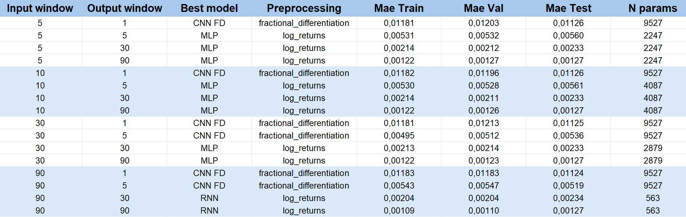
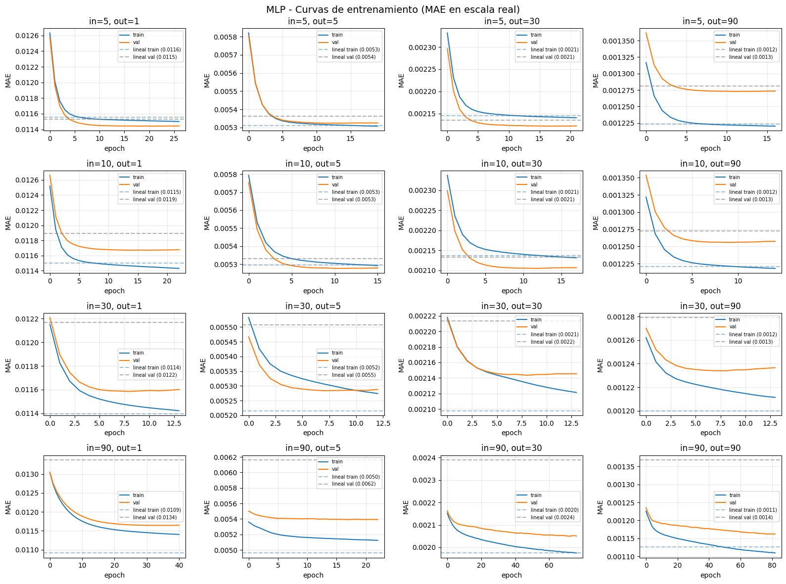
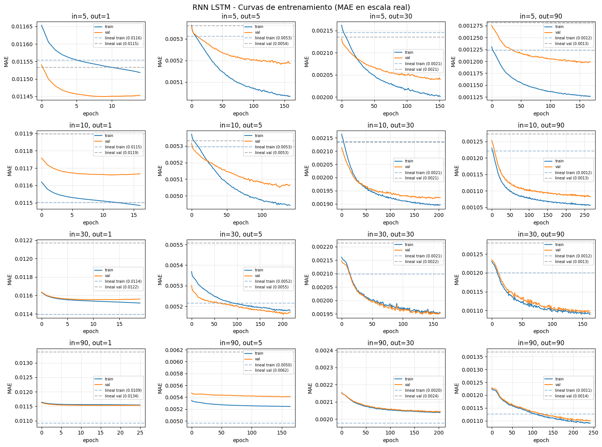
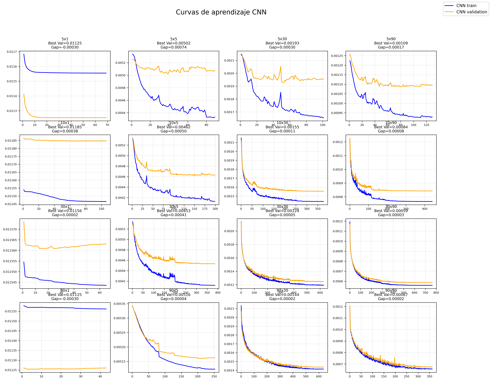
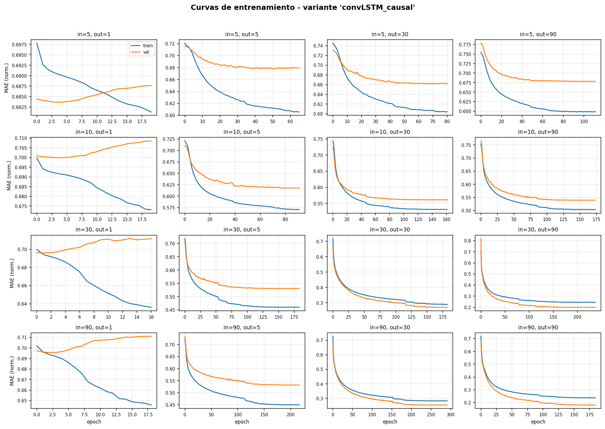
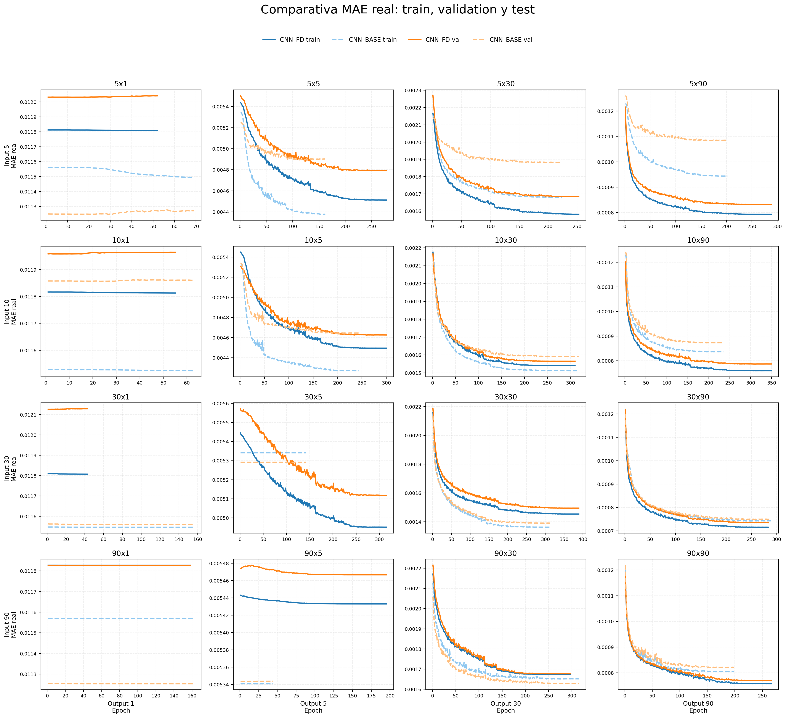

# 📈 Deep Learning para Forecasting Financiero

> Predicción de series temporales financieras utilizando redes neuronales densas, convolucionales, recurrentes y modelos híbridos sobre múltiples horizontes temporales.

---

# 🚀 Descripción del Proyecto

Este proyecto explora el uso de arquitecturas clásicas de *Deep Learning* aplicadas a *forecasting financiero* utilizando datos históricos diarios de 23 activos del S&P500.

El objetivo principal es estudiar cómo diferentes arquitecturas neuronales son capaces de aprender patrones temporales del mercado bajo distintas ventanas de entrada y predicción.

A lo largo del proyecto se desarrollaron y compararon:

- 🧠 Redes densas (*Dense Networks*)
- 🌊 Redes recurrentes (*RNN / LSTM*)
- 🧩 Redes convolucionales (*CNN*)
- 🔀 Redes mixtas
- 🧪 Analizamos otras formas de plantear el problema:
        - Diferenciación Fraccional
        - Triple Barrier Labeling
- 💼 Backtesting de carteras

---

# 🎯 Objetivos

Los principales objetivos del proyecto son:

- Aplicar modelos de Deep Learning a problemas financieros reales.
- Estudiar el impacto de distintas ventanas temporales.
- Comparar arquitecturas neuronales para forecasting.
- Analizar el efecto de técnicas avanzadas de preprocesado financiero.
- Construir estrategias de inversión basadas en predicciones del modelo.

---

# 📊 Dataset

Se utilizaron datos diarios de cierre de:

- 📌 23 activos del S&P500
- 📆 Desde 1960
- 📈 Más de 16.000 días de mercado

## Formato de entrada

```text
X → (N x V x Ch)
```

Donde:

- `N` → número de muestras
- `V` → ventana temporal de entrada
- `Ch` → número de activos (23)

---

## Formato de salida

```text
Y → (N x Ch)
```

El objetivo consiste en predecir el promedio futuro del precio de cierre durante la ventana temporal de salida, aunque en realidad transformaremos el problema a predecir retornos logaríticos.

---

# ⏳ Ventanas Temporales

Se realizó un grid completo utilizando múltiples combinaciones temporales.

## Ventanas de entrada

```python
[5, 10, 30, 90]
```

## Ventanas de salida

```python
[1, 5, 30, 90]
```

---

# ⚙️ Entrenamiento

Los modelos fueron entrenados utilizando:

- MAE Loss
- Adam Optimizer
- EarlyStopping
- ReduceLROnPlateau
- ModelCheckpoint

Además, el proyecto incluye:

- curvas de aprendizaje
- métricas de train / validation / test
- almacenamiento de predicciones
- comparación de modelos
- análisis visual de resultados

---

# 📌 Principales Resultados

## 🔍 Observaciones importantes

- Las predicciones a muy corto plazo (`OW=1`) son extremadamente difíciles debido al ruido financiero.
- Horizontes medios y largos (`OW=30`, `OW=90`) muestran estructuras temporales más estables.
- La diferenciación fraccional mejoró el aprendizaje interno en varios escenarios.
- Modelos excesivamente complejos tendieron a sobreajustar.

---

# 🏆 Resultados de la Competición

## 📊 Matriz de mejores resultados en test





---

# 📈 Algunas curvas de Entrenamiento











---

# 🧪 CNN vs Diferenciación Fraccional





---

# 💼 Backtesting de Carteras

Utilizando el mejor modelo para horizontes largos (`OW=90`), se construyeron dos estrategias:

- 📌 Cartera baseline sin predicciones
- 🤖 Cartera basada en predicciones del modelo

Ambas estrategias fueron evaluadas durante 2025.

> TODO: Insertar resultados de backtesting.

---

# 🗂️ Estructura del Repositorio

```text
project/
│
├── notebooks/
├── results/
├── final_results/
└── README.md
```

---

# 🛠️ Tecnologías Utilizadas

## 📚 Librerías principales

- Python
- TensorFlow / Keras
- NumPy
- Pandas
- Scikit-learn
- Matplotlib
- Seaborn

---

# 🔮 Líneas Futuras

Posibles extensiones futuras:

- 🤖 Transformers
- 👁️ Attention Mechanisms
- 🌍 Detección de regímenes de mercado
- 📊 Ranking cross-sectional
- 🎮 Reinforcement Learning
- ⚛️ Optimización cuántica para carteras

---

# 👥 Autores

- Miriam Del Blanco
- ALbert Martin
- Andrea Labá

---

# 📚 Referencias

- López de Prado — *Advances in Financial Machine Learning*
- TensorFlow Documentation
- Fractional Differentiation literature
- Triple Barrier Methodology
- Papers de Deep Learning financiero


